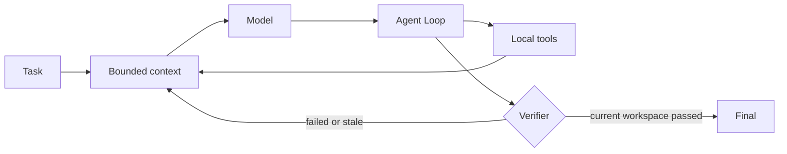

# zxn-coding-agent

一个运行在本地工作区中的 Coding Agent。它接收自然语言任务，自主阅读和搜索代码、修改文件、执行命令，并根据真实验证结果决定继续修复或结束。

项目使用 Python 和 OpenAI-compatible Chat Completions API，不依赖 Agent 框架。Agent Loop、上下文管理、工具调度、权限控制、状态恢复和验证门禁都保持为可阅读、可测试的本地实现。

## Features

- 持续执行 `LLM -> tool calls -> local results -> LLM`，完整处理工具协议、错误与终止条件。
- 提供文件读取、精确编辑、代码搜索、Python Repo Map、命令执行和验证等 10 个本地工具。
- 支持 one-shot 与交互式会话，可恢复 Session，并可通过 Checkpoint 撤销 Agent 的文件修改。
- 使用 PermissionManager、GitGuard 和 workspace 边界保护已有工作与敏感文件。
- 将验证结果绑定到具体 workspace fingerprint；验证后代码再次变化时拒绝结束。
- 对长命令输出、重复读取和历史上下文进行有界处理，支持可选的任务 Token 预算。

## Quick start

需要 Python 3.10 或更高版本。

```powershell
git clone https://github.com/ashokhaldar924-dev/zxn-coding-agent.git
cd zxn-coding-agent
python -m pip install -r requirements.txt
```

通过环境变量配置 OpenAI-compatible endpoint：

```powershell
$env:AGENT_API_KEY="your-api-key"
$env:AGENT_BASE_URL="https://your-endpoint"
$env:AGENT_MODEL="your-model-name"
```

API Key 只从环境变量读取。其他可选参数见 [`.env.example`](.env.example)。

### Run a task

```powershell
python .\agent.py --workspace "D:\path\to\project" "检查项目，运行失败测试，定位并修复实现；不要修改测试，完成后实际验证。"
```

使用 `--yes` 可以自动通过需要确认的操作，但不能绕过 Runtime 明确禁止的危险行为：

```powershell
python .\agent.py --yes --workspace "D:\path\to\project" "修复当前项目中的失败测试并验证结果。"
```

### Interactive mode

省略任务参数即可持续输入自然语言任务：

```powershell
python .\agent.py --workspace "D:\path\to\project"
```

交互模式支持：

| 输入 | 作用 |
| --- | --- |
| `/status` | 查看 Session、workspace revision、验证和 Token 状态 |
| `/sessions`、`/resume [id]` | 列出或恢复历史 Session |
| `/new`、`/clear` | 开始新上下文 |
| `/checkpoints`、`/undo`、`/restore <id>` | 查看或恢复 Agent 文件修改 |
| `@path` | 将工作区文件作为有界上下文加入任务 |
| `!command` | 由用户主动执行命令，并选择是否发送结果给模型 |
| `/help`、`/exit` | 查看帮助或退出 |

## Runtime



模型负责选择下一步操作；Runtime 负责解析 `tool_calls`、执行本地工具、维护工作区状态和实施最终门禁。

### Local tools

| 类型 | 工具 | 作用 |
| --- | --- | --- |
| Observe | `read_file` | 按行读取工作区文本 |
| Observe | `read_command_output` | 分段读取已保存的长命令输出 |
| Observe | `list_dir` | 查看一层目录 |
| Observe | `glob_files` | 按相对 glob 查找文件 |
| Observe | `search_text` | 字面或正则搜索 |
| Observe | `repo_map` | 提取 Python 类、函数、方法和行号 |
| Effect | `write_file` | 创建或完整改写文件 |
| Effect | `edit_file` | 对唯一匹配片段进行精确替换 |
| Effect | `run_command` | 执行探索、构建或诊断命令 |
| Effect | `check_command` | 验证当前 workspace revision |

### Safety and state

- 文件工具只访问解析后仍位于 workspace 内的路径；私有 `.agent` 数据不可被 Agent 工具读取。
- 普通开发操作保持低打扰，已有用户改动、敏感文件和高影响命令需要确认，明确危险的操作直接拒绝。
- 命令前后使用增量 workspace snapshot 检测外部变化；未变化文件复用已有 digest。
- 内置噪声、Git 项目的根 `.gitignore` 和可选 `.agentignore` 可排除可再生产物；Git 已跟踪文件不会被项目模式隐藏。
- 验证同时绑定 revision 与 workspace fingerprint，final 前会再次核对当前代码状态。
- Session、trajectory、Checkpoint 和截断命令全文保存在 workspace 的私有 `.agent/` 目录。

更完整的状态语义、安全边界和设计取舍见 [`DESIGN.md`](DESIGN.md)。

## Tests and evaluation

离线测试不需要 API Key：

```powershell
python -m unittest discover -s tests -v
python -m compileall -q .
```

95 个测试覆盖 Agent Loop、tool-call 解析、上下文裁剪、权限、Checkpoint、Session、陈旧写保护、增量 workspace snapshot、长输出恢复、验证门禁和终止条件。

`evals/` 提供 8 个隔离的代码修复任务。Harness 会保护测试文件、运行固定 verifier，并记录成功、首次验证、失败恢复、耗时、Token 和工具调用：

```powershell
python .\evals\run_eval.py --dry-run
python .\evals\run_eval.py
```

评测结果写入已忽略的 `evals/results/`。

## Project layout

```text
agent.py                Agent Loop、tool-call 解析与 CLI
llm.py                  OpenAI-compatible 模型请求
ctx.py / state.py       有界上下文与 RuntimeState
tools.py                工具 schema、registry 与 dispatcher
workspace_state.py      workspace snapshot 与陈旧写保护
command_runtime.py      命令执行、超时和长输出存储
permissions.py          ALLOW / ASK / DENY 权限策略
checkpoint.py           文件 before-image 与安全恢复
session.py / log.py     Session 与 trajectory
interactive.py          交互命令、@file 与 !command
evals/                  可重复评测任务
tests/                  离线测试
DESIGN.md               设计说明与实现边界
```

## Limitations

- Shell 以 workspace 为当前目录，但不是操作系统级沙箱。
- Repo Map 当前只分析 Python；其他语言仍可使用 glob、搜索、读取和项目命令。
- 模型请求当前为非流式，CLI 不提供完整 TUI。
