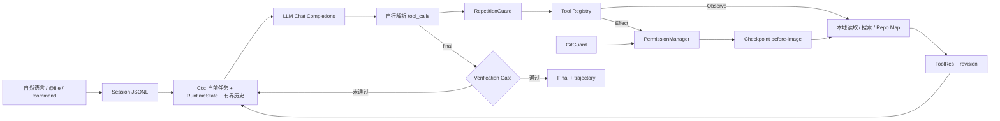

# zxn-coding-agent

> 一个小而完整、可持续交互、可恢复的本地 Coding Agent：模型决定下一步动作，本地 Runtime 负责读写代码、执行命令、保护用户工作并决定何时允许结束。

`Python 3.10+` · `OpenAI-compatible Chat Completions` · `9 local tools` · `73 offline tests`

本项目自行实现 Agent Loop、上下文管理、原生 `tool_calls` 解析、本地工具执行、循环终止、错误恢复和验证门禁；不依赖 LangChain、OpenAI Agents SDK、Claude Agent SDK、AutoGen、CrewAI 等 Agent 框架，也不调用 API 服务端托管的代码执行或文件工具。

## 快速开始

### 1. 安装与配置

```powershell
python -m pip install -r requirements.txt

$env:AGENT_API_KEY="your-api-key"
$env:AGENT_BASE_URL="https://your-openai-compatible-endpoint/v1"
$env:AGENT_MODEL="your-model-name"
```

凭据只从环境变量读取。不要把真实 API key 写进源码、文档、截图、视频或 Git 历史。

### 2. One-shot 任务

保留原来的一次性调用方式：

```powershell
python .\agent.py --workspace "D:\path\to\project" "检查项目，运行失败测试，定位并修复实现；不要修改测试，最后用 check_command 验证。"
```

### 3. 持续交互模式

省略任务参数会进入可连续使用的交互式 CLI：

```powershell
python .\agent.py --workspace "D:\path\to\project"
```

随后直接输入自然语言任务。每个任务仍运行完整的 Agent Loop，但同一进程内会保留对话、workspace revision、改动文件和本次批准。

常用命令：

| 命令 | 作用 |
| --- | --- |
| `/status` | 查看 session、revision、验证、文件和 token 状态 |
| `/sessions` | 列出当前 workspace 最近的 sessions |
| `/resume [id]` | 恢复最近或指定 session |
| `/new`、`/clear` | 下一条任务开始全新上下文 |
| `/checkpoints` | 查看可恢复的 Agent 文件修改 |
| `/undo` | 安全撤回最近一次 Agent 文件修改 |
| `/restore <id>` | 恢复指定 checkpoint |
| `/help`、`/exit` | 查看帮助或退出 |

两个输入快捷方式：

```text
检查 @src/pricing.py 的折扣逻辑
比较 @"docs/design notes.md" 和当前实现
!python -m unittest discover -s tests -v
```

- `@file` 只读取 workspace 内的 UTF-8 文本，默认每个文件最多注入 12,000 字符。
- `!command` 是用户主动执行的 shell 命令；执行后可以选择是否把命令和输出交给模型。它不经过模型权限决策，并会保守地令旧 verification 失效。

### 4. 恢复退出前的 session

```powershell
python .\agent.py --workspace "D:\path\to\project" --list-sessions
python .\agent.py --workspace "D:\path\to\project" --resume
python .\agent.py --workspace "D:\path\to\project" --resume a1b2c3d4
python .\agent.py --workspace "D:\path\to\project" --resume a1b2c3d4 "继续修复剩余失败测试"
```

Session 保存在 workspace 的 `.agent/sessions/` 中。恢复时重建用户任务、assistant tool calls、tool results、revision、改动文件和 token 统计，但以下状态故意不跨进程继承：

- 临时文件/命令批准；
- 连续错误计数；
- 重复调用计数；
- 旧的成功 verification。

程序退出期间代码可能被用户或其他进程修改，因此恢复后必须重新验证，不能拿旧结果证明当前代码。

## 架构



核心数据流仍然是透明的单 Agent 循环：

```text
User -> LLM -> tool_calls -> local tools -> tool results -> LLM -> ... -> Final
```

外围机制通过 `Ctx`、`PermissionManager`、`GitGuard`、`CheckpointManager`、`RepetitionGuard` 和持久化回调组织；没有引入通用插件框架或 Agent SDK。

## 九个本地工具

| 类型 | 工具 | 行为 |
| --- | --- | --- |
| Observe | `read_file` | 按 1-based 范围读取文本，每次最多 200 行 |
| Observe | `list_dir` | 列出一层目录，跳过常见缓存和运行噪声 |
| Observe | `glob_files` | 相对 glob 文件查找，最多返回 100 条路径 |
| Observe | `repo_map` | 用 Python AST 提取类、函数、方法和行号 |
| Observe | `search_text` | 默认字面搜索；`regex=true` 时使用 Python regex |
| Effect | `write_file` | 创建或覆写完整文本文件，先展示 unified diff |
| Effect | `edit_file` | `old` 必须非空且恰好匹配一次，再展示 diff |
| Effect | `run_command` | 执行探索命令，返回 exit code/stdout/stderr/timeout |
| Effect | `check_command` | 验证当前 revision；受可选 final verifier 约束 |

所有 schema、registry、dispatcher 和本地实现都在仓库中自行编写。模型 API 只接收普通 function schemas。

## 关键可靠性机制

### Permission 与 Git 保护

`PermissionManager` 的结果只有 `ALLOW / ASK / DENY`：

- Observe 工具自动执行；
- 干净文件编辑可批准一次或允许本进程后续干净文件编辑；
- 命令只记住完整命令字符串，参数变化会重新询问；
- 启动前已 dirty 的 Git 文件必须单独批准；
- `git reset --hard`、强制 `git clean`、磁盘格式化、系统关机和根目录递归删除等高置信度危险命令直接拒绝。

用户拒绝是 `ToolRes(ok=True, rejected=True)`；策略/停滞阻止是 `ToolRes(ok=True, blocked=True)`。它们是模型可观察结果，不会被误计为 Runtime 崩溃。

`--yes` 或 `AGENT_CONFIRM=false` 只跳过普通询问，不能绕过硬拒绝：

```powershell
python .\agent.py --yes --workspace "D:\isolated\project" "修复并验证"
```

### Checkpoint / Restore / Undo

`write_file` 或 `edit_file` 真正落盘前，Runtime 会把原始字节保存到 `.agent/checkpoints/<session-id>/`，同时记录 Agent 预期写入后的 SHA-256。

恢复时只有当前文件仍等于该 after-hash 才执行：

- 原有文件恢复为准确 before-image；
- Agent 新建文件被删除；
- 多次编辑按 LIFO 顺序撤回；
- 如果用户在 Agent 修改后又手工编辑，恢复会拒绝覆盖。

该机制只覆盖 Agent 文件工具造成的变化。Shell、外部程序、文件权限和任意系统副作用不在恢复承诺内；checkpoint 也不替代 Git。

### Session 与完整轨迹

- `.agent/sessions/session-*.jsonl`：可恢复的完整线性会话，保存 task 与完整 logical groups。
- `.agent/run-*.jsonl`：当前进程的审计 trajectory，记录模型响应、token、工具调用/结果、拒绝、门禁和终止。
- 模型实际收到的 context 是经过预算处理的视图，不等于完整 session/trajectory。

JSONL 采用追加写、flush 和 fsync。恢复可容忍进程被终止后留下的一条不完整末行，但不会静默忽略中间损坏。

### Cheap-first Context 与 RuntimeState

`Ctx` 同时使用：

1. logical-group 边界，绝不拆开 assistant tool call 与对应 results；
2. 字符预算；
3. 基于 UTF-8 字节数的保守 token 估算预算；
4. 旧 tool output 优先压缩；
5. 仍超预算才删除最旧完整 groups；
6. 当前用户任务和最新 groups 始终保留。

每轮请求还会重新注入确定性的 RuntimeState：当前 revision、验证状态、Agent 修改文件、最新检查和外部 shell 变更标记。因此长任务裁掉早期细节后，不必让模型凭记忆猜测运行状态。

项目暂不做 LLM compaction summary。自动摘要会增加额外模型调用、信息丢失和新的失败路径；当前先采用可离线复现的 cheap-first 方案。

### Python Repo Map

`repo_map` 按需扫描 `.py` 文件并使用标准库 `ast` 提取：

```text
src/service.py
  L12 class Service(BaseService)
    L18 async def run(self, request)
  L44 def build_service(config)
```

它帮助模型先定位符号，再用 `read_file` 阅读具体实现。结果有文件数、符号数和总字符上限；解析失败的文件会统计提示。当前只支持 Python，不使用 tree-sitter、LSP、embedding、RAG 或常驻索引。

### Revision-aware Final Verifier

每次 Agent 文件修改令 `rev += 1`。只有当前 revision 被成功验证后，修改型任务才能结束。

默认由模型选择 `check_command`。如需更可靠的项目/用户 oracle，可配置精确 final verifier：

```powershell
$env:AGENT_FINAL_VERIFIER="python -m unittest discover -s tests -v"
```

也可以在 workspace 根目录创建 `.agent-verifier`，内容为一条命令。环境变量优先。

配置后：

- 其他检查即使 exit code 为 0，也不能打开 final gate；
- 指定 verifier 必须通过且对应当前 revision；
- 同一 verifier 后来失败会撤销旧验证；
- 恢复 session 后旧验证必定失效；
- 用户主动 `!command` 会保守地令旧验证失效。

这仍不是形式化正确性证明：它只能证明用户/项目选择的命令在当前 Runtime revision 上成功执行过。

## 配置

| 环境变量 | 默认值 | 说明 |
| --- | --- | --- |
| `AGENT_API_KEY` | 无，必填 | OpenAI-compatible API key |
| `AGENT_BASE_URL` | `https://api.openai.com/v1` | API 根地址 |
| `AGENT_MODEL` | 无，必填 | provider 支持的模型名 |
| `AGENT_WORKSPACE` | 当前目录 | 文件与命令工作区 |
| `AGENT_MAX_STEPS` | `30` | 每个自然语言任务最大模型轮数 |
| `AGENT_MAX_TIME` | `600` | 每个任务最大墙钟秒数 |
| `AGENT_MAX_TOOL_CHARS` | `12000` | 单次工具结果字符上限 |
| `AGENT_MAX_GROUPS` | `8` | 模型视图最多保留的 logical groups |
| `AGENT_MAX_CONTEXT_CHARS` | `60000` | Context 字符预算 |
| `AGENT_MAX_CONTEXT_TOKENS` | `32000` | Provider-independent 近似 token 预算 |
| `AGENT_CONTEXT_KEEP_FULL_GROUPS` | `1` | 始终完整保留的最新 groups 数量 |
| `AGENT_MAX_PROJECT_CONTEXT_CHARS` | `12000` | 根目录 `AGENTS.md` 注入上限 |
| `AGENT_MAX_FILE_REFERENCE_CHARS` | `12000` | 单个 `@file` 注入上限 |
| `AGENT_CMD_TIMEOUT` | `60` | 单条命令最大秒数 |
| `AGENT_MAX_ERRORS` | `4` | 连续 Runtime tool errors 上限 |
| `AGENT_MAX_IDENTICAL_CALLS` | `3` | 连续相同工具调用阻止阈值 |
| `AGENT_CONFIRM` | `true` | 是否确认 Effect 工具 |
| `AGENT_FINAL_VERIFIER` | 无 | 可选精确 final verifier 命令 |

`.env.example` 只是非敏感配置清单，程序不会自动读取 `.env`。

## 测试与真实任务 Eval

全部单元测试使用 FakeLLM 和临时目录，不需要 API key，也不会调用网络：

```powershell
python -m unittest discover -s tests -v
python -m py_compile agent.py checkpoint.py config.py ctx.py gitguard.py guards.py interactive.py llm.py log.py permissions.py project_context.py session.py state.py tools.py ui.py
```

当前 73 个离线测试覆盖 Agent Loop、tool-call 协议、session round-trip、持久化回调、恢复后安全状态重置、交互输入、checkpoint/冲突/LIFO undo、token-aware context、RuntimeState、AST repo map、Permission/Git Guard、final verifier、终止条件、HTTP 重试和敏感信息脱敏。

`evals/` 另带 8 个真实小型修复任务，覆盖计算、边界条件、状态、缓存、配置和文本处理。Harness 会：

- 确认每个 fixture 初始测试失败；
- 运行真实模型 Agent；
- 哈希检查测试文件未被修改；
- 重新运行固定 final verifier；
- 记录成功率、步数、token、工具调用、失败检查与恢复。

离线验证 fixtures：

```powershell
python .\evals\run_eval.py --dry-run
```

配置真实模型后运行全部 8 个任务：

```powershell
python .\evals\run_eval.py
```

结果写入已 Git-ignore 的 `evals/results/eval-*.json`。当前仓库只验证了 8/8 dry-run fixtures 均初始失败；没有在文档中伪造真实模型成功率。

## 仓库结构

```text
.
├── agent.py              # Agent Loop、tool-call 解析、门禁与 CLI 编排
├── llm.py                # 一次透明 Chat Completions 请求与有限重试
├── ctx.py                # 多轮 logical groups、token/字符预算、cheap-first pruning
├── tools.py              # 9 个 schema、registry、dispatcher 与本地工具
├── session.py            # 可恢复线性 JSONL session
├── checkpoint.py         # before-image、哈希冲突检测与 restore
├── interactive.py        # /commands、@file、!command 辅助逻辑
├── permissions.py        # ALLOW / ASK / DENY 与进程内批准
├── gitguard.py           # 启动时 Git dirty snapshot
├── guards.py             # 确定性重复调用护栏
├── project_context.py    # 有界加载根目录 AGENTS.md
├── state.py              # ToolRes、RuntimeState 与 revision 状态
├── log.py                # 与模型 context 分离的 JSONL trajectory
├── config.py             # 环境变量与 final verifier 配置
├── ui.py                 # ANSI 状态、警告和 diff 配色
├── evals/                # 8-case opt-in real-model eval harness
├── tests/                # 73 个离线测试
└── DESIGN.md             # 设计理由、替代方案与边界
```

## 安全边界与已知局限

- 文件工具解析真实路径并限制在 workspace；递归搜索跳过越界符号链接。
- shell 只设置 `cwd=workspace`，**不是 OS-level sandbox**，仍可访问工作区外资源。
- `!command` 是人类直接执行入口，不经过 Agent permission policy。
- Checkpoint 只覆盖本项目文件编辑工具，不覆盖 shell、副进程或文件元数据副作用。
- Session 与 trajectory 可能包含任务文本、代码片段和命令输出；它们默认仅保存在本地，不应未经检查直接分享。
- Final verifier 命令会进入模型 RuntimeState 和本地日志，不要把凭据写在命令字符串中。
- Session 是线性历史，不实现 branch/tree/fork；同时打开同一个 session 的多个进程可能交错写入。
- Token 预算是 provider-independent 估算，不等于特定模型 tokenizer 的精确值。
- Repo Map 当前仅支持 Python AST。
- 项目不实现 streaming、RAG、向量库、完整 TUI、多 Agent、MCP、Skills、通用 hooks/plugins、自动 Git commit 或 OS 沙箱。

## 设计资料

以下资料仅用于理解成熟 Coding Agent 的共同设计思路；项目没有复制其源码，也不依赖其 Agent 框架：

- [How to Build an Agent](https://ampcode.com/notes/how-to-build-an-agent)
- [mini-SWE-agent](https://github.com/SWE-agent/mini-swe-agent)
- [SWE-agent / ACI paper](https://arxiv.org/abs/2405.15793)
- [Aider Repository Map](https://aider.chat/docs/repomap.html)
- [Pi Coding Agent](https://github.com/badlogic/pi-mono)
- [Claude Code sessions](https://code.claude.com/docs/en/sessions)
- [Claude Code checkpointing](https://code.claude.com/docs/en/checkpointing)
- [OpenCode](https://github.com/anomalyco/opencode)
- [Building Effective Agents](https://www.anthropic.com/engineering/building-effective-agents)
- [my-pi-agent](https://github.com/zxj-2023/my-pi-agent)

详细设计决策见 [`DESIGN.md`](DESIGN.md)。
