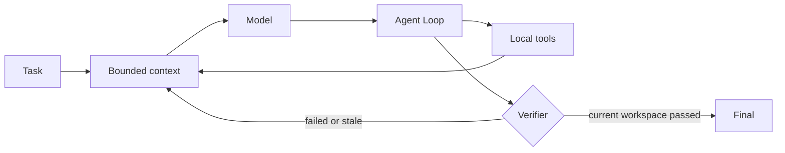

# zxn-coding-agent

[](https://github.com/ashokhaldar924-dev/zxn-coding-agent/actions/workflows/ci.yml)


一个运行在本地工作区中的 Coding Agent。它接收自然语言任务，自主阅读和搜索代码、修改文件、执行命令，并根据真实验证结果决定继续修复或结束。

项目使用 Python 和 OpenAI-compatible Chat Completions API，不依赖 Agent 框架。Agent Loop、上下文管理、工具调度、权限控制、状态恢复和验证门禁都保持为可阅读、可测试的本地实现。

## Features

- 持续执行 `LLM -> tool calls -> local results -> LLM`，完整处理工具协议、错误与终止条件。
- 提供文件读取、原子精确编辑、代码搜索、多语言 Repo Map、轻量规划、命令执行和验证等 12 个本地工具。
- 支持 one-shot 与交互式会话，可恢复 Session，并可通过 Checkpoint 撤销 Agent 的文件修改。
- 复杂任务可维护可恢复的轻量 Plan；Plan 只展示方向，最终完成仍由真实验证状态决定。
- 终端与可选桌面 GUI 都以紧凑时间线展示 Plan、代码操作、真实文件行数、命令结果和最终验证，不输出原始 tool JSON。
- 使用 PermissionManager、GitGuard 和 workspace 边界保护已有工作与敏感文件。
- 将验证结果绑定到具体 workspace fingerprint；验证后代码再次变化时拒绝结束。
- 区分验证新鲜度与充分性；用户明确要求全部测试时，局部测试通过不能打开最终门禁。
- 对连续失败的 `check_command` 建立去噪指纹；相同失败三次未推进时明确以 `NO_PROGRESS` 停止。
- 最终结果、Plan Evidence、恢复和报告都来自 Runtime 事实，不根据模型总结猜测完成状态。
- 对工具 schema、输出预留、长结果和历史上下文统一做有界处理；近期精确源码观察会作为限额工具证据保留，文件变化后立即失效，减少裁剪后的重复读取。
- Evidence Report 在 provider 支持时拆分输入、输出、缓存命中、缓存未命中和推理 Token；缺失字段不会被伪造为 0。

## Quick start

需要 Python 3.10 或更高版本。

```powershell
git clone https://github.com/ashokhaldar924-dev/zxn-coding-agent.git
cd zxn-coding-agent
python -m pip install -e .
```

通过环境变量配置 OpenAI-compatible endpoint：

```powershell
$env:AGENT_API_KEY="your-api-key"
$env:AGENT_BASE_URL="https://your-endpoint"
$env:AGENT_MODEL="your-model-name"
```

API Key 只从环境变量读取；Windows 下也会读取当前用户的持久环境变量，旧终端无需重复设置。其他可选参数见 [`.env.example`](.env.example)。

### Run a task

```powershell
zxn-agent --workspace "D:\path\to\project" "检查项目，运行失败测试，定位并修复实现；不要修改测试，完成后实际验证。"
```

使用 `--yes` 可以自动通过需要确认的操作，但不能绕过 Runtime 明确禁止的危险行为：

```powershell
zxn-agent --yes --workspace "D:\path\to\project" "修复当前项目中的失败测试并验证结果。"
```

### Interactive mode

省略任务参数即可持续输入自然语言任务：

```powershell
zxn-agent --workspace "D:\path\to\project"
```

交互模式支持：

| 输入 | 作用 |
| --- | --- |
| `/status` | 查看 Session、workspace revision、验证和 Token 状态 |
| `/sessions`、`/resume [id]` | 列出或恢复历史 Session |
| `/new`、`/clear` | 开始新上下文 |
| `/checkpoints`、`/undo`、`/restore <id>` | 查看或恢复 Agent 文件修改 |
| `@path` | 将工作区文件作为有界上下文加入任务 |
| `!command` | 由用户主动执行命令，并选择是否发送结果给模型 |
| `/help`、`/exit` | 查看帮助或退出 |

终端只呈现当前任务需要的信息，例如：

```text
Plan
  ✓ Inspect implementation
  ● Apply focused fix
  ○ Run verification

  Modified src/state.py
    +14  -5

• Verifying with pytest -q
  ✓ 144 passed

FINAL VERIFIED
```

TTY 使用少量颜色；重定向、CI 或不支持 Unicode 的 Windows 输出自动退化为无 ANSI 的纯文本。

### Desktop GUI

GUI 是可选的 PySide6 单窗口界面，不影响基础 CLI 依赖：

```powershell
python -m pip install -e ".[gui]"
zxn-agent --gui --workspace "D:\path\to\project"
```

界面左侧提供当前工作区的只读项目树和本轮 Changes，中间显示任务、工具、文件变化与命令摘要，右侧固定显示 Plan 和 Runtime Verification。顶部可以切换或重新打开最近工作区，并从本地 Session History 恢复任务；底部直接输入自然语言任务。Plan 下方的 Evidence 只引用真实工具事件。

运行期间“运行”会切换为“停止”。停止请求会中止正在执行的普通命令进程树，忽略尚未返回的模型响应，并把任务明确标记为已停止，不会把最近一次局部或历史验证渲染成“最终验证通过”。文件预览是只读的；“改动”中的差异只来自 Checkpoint 保存的 before-image 与当前文件，不会根据日志或模型文本猜测内容。“恢复”只撤销本轮由文件工具造成且未被外部改写的变化，“导出”输出由 Runtime 生成的 Evidence Report；恢复后旧验证立即失效。

## Runtime



模型负责选择下一步操作；Runtime 负责解析 `tool_calls`、执行本地工具、维护工作区状态和实施最终门禁。

### Local tools

| 类型 | 工具 | 作用 |
| --- | --- | --- |
| Observe | `read_file` | 按行读取文本，限制超长单行并提供续读位置 |
| Observe | `read_command_output` | 分段读取已保存的长命令输出 |
| Observe | `list_dir` | 分页查看一层目录 |
| Observe | `glob_files` | 分页执行相对 glob 查找 |
| Observe | `search_text` | 分页执行字面或正则搜索 |
| Observe | `repo_map` | 提取 Python 及常见编程语言的声明与行号 |
| Navigate | `update_plan` | 调查现有仓库后更新任务特有的技术里程碑，不参与验证门禁 |
| Effect | `write_file` | 创建或完整改写文件 |
| Effect | `edit_file` | 对唯一匹配片段进行精确替换 |
| Effect | `multi_edit` | 在一个文件中原子应用多个有序精确替换 |
| Effect | `run_command` | 以有界内存执行探索、构建或诊断命令 |
| Effect | `check_command` | 验证当前 workspace revision |

### Safety and state

- 文件工具只访问解析后仍位于 workspace 内的路径；私有 `.agent` 数据不可被 Agent 工具读取。
- 普通开发操作保持低打扰，已有用户改动、敏感文件和高影响命令需要确认，明确危险的操作直接拒绝。
- 命令输出先写入临时文件，超长结果流式保存并按范围读取；超时会终止普通子进程树，Agent API Key 不传给命令进程。
- 命令前后使用增量 workspace snapshot 检测外部变化；未变化文件复用已有 digest。
- 内置噪声、Git 项目的根 `.gitignore` 和可选 `.agentignore` 可排除可再生产物；Git 已跟踪文件不会被项目模式隐藏。
- 验证同时绑定 revision 与 workspace fingerprint，final 前会再次核对当前代码状态。
- Session 记录创建或确认时的 Git HEAD；恢复到不同代码基线时要求用户确认。
- Session、trajectory、Checkpoint 和截断命令全文保存在 workspace 的私有 `.agent/` 目录。

更完整的状态语义、安全边界和设计取舍见 [`docs/DESIGN.md`](docs/DESIGN.md)。

## Tests and evaluation

离线测试不需要 API Key：

```powershell
python -m pip install -e ".[dev]"
ruff check .
python -m unittest discover -s tests -v
python -m compileall -q src tests evals agent.py
```

离线测试覆盖 Agent Loop、tool-call/finish-reason 协议、失败修复进度、Planner Evidence、终端与 GUI presenter、Evidence Report、任务级恢复、工作区切换与历史数据、用户停止、验证范围、真实 Diff/行数统计、请求预算、可分页 observation、原子编辑、多语言代码概览、权限、Checkpoint、Session、陈旧写保护、增量 workspace snapshot、命令进程树与长输出恢复、验证门禁和终止条件。

`evals/` 提供 8 个隔离的代码修复任务。Harness 会保护可见测试，Agent 退出后再在独立目录运行 hidden grader，并记录成功、错误完成、首次验证、失败恢复、`NO_PROGRESS`、耗时、Token、模型与工具调用。`--repeat` 支持重复运行预先选定的任务：

```powershell
python .\evals\run_eval.py --dry-run
python .\evals\run_eval.py
python .\evals\run_eval.py --case percentage-pricing --repeat 3
```

评测结果写入已忽略的 `evals/results/`。公开结果使用冻结的模型、数据集、选题规则和预算，并保留所有失败或提前停止的任务：

| Run | Result | Scope |
| --- | ---: | --- |
| Local hidden repair suite | **8/8 (100%)** | 8 个隔离修复任务，Agent 退出后运行 hidden grader |
| BigCodeBench Instruct | **15/30 (50.0%)** | 固定标准库子集，官方远程 evaluator，Pass@1 |

完整配置、任务级结果和解释见 [`evals/BENCHMARK_RESULTS.md`](evals/BENCHMARK_RESULTS.md)，冻结规则见 [`evals/BENCHMARK_PROTOCOL.md`](evals/BENCHMARK_PROTOCOL.md)。BigCodeBench 数字是确定性的 30 题 Pilot，不是完整排行榜成绩。

## Project layout

```text
src/zxn_agent/          可安装的 Agent Runtime、CLI 与桌面 GUI
tests/                  Agent Loop 和各项 Runtime 边界的离线测试
evals/                  隔离修复任务、评测协议与公开结果
docs/DESIGN.md          状态语义、边界与设计取舍
agent.py                源码克隆场景的兼容启动入口
pyproject.toml          包元数据、依赖、命令入口与开发配置
.github/workflows/      Linux / Windows 持续集成
```

安装后推荐使用 `zxn-agent`；直接从源码克隆运行时，原有的 `python agent.py ...` 命令仍然可用。

## Limitations

- Shell 以 workspace 为当前目录，但不是操作系统级沙箱。
- 非 Python Repo Map 使用保守的声明匹配而非完整语法树，结果只用于定位，修改前仍需读取源码。
- 模型请求当前为非流式；Stop 会立即让 Runtime 放弃等待并忽略迟到响应，但底层 HTTP 请求线程可能继续到 provider timeout。
- 桌面 GUI 的文件预览是只读的，不提供 IDE 编辑器、Settings 页面或 Git 操作面板。
- 未配置精确 final verifier 时，全量范围识别采用保守的常见命令规则；无法确认范围的命令不会被当作全量验证。
- 当前公开的 BigCodeBench 结果是固定 30 题 Pilot；它用于可重复比较版本，不代表完整排行榜成绩。
