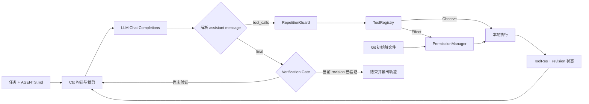

# zxn-coding-agent

> 一个小而完整、可真实运行的本地编程智能体：接收自然语言任务，自主读取代码、调用本地工具、修改文件、运行测试，并在当前代码版本通过验证后结束。

`Python 3.10+` · `OpenAI-compatible Chat Completions` · `8 local tools` · `55 unit tests`

本项目从基础组件自行实现 Agent Loop、上下文管理、原生 `tool_calls` 解析、本地工具执行、终止条件、错误恢复和验证门禁；不依赖 LangChain、OpenAI Agents SDK、Claude Agent SDK、AutoGen、CrewAI 等 Agent 框架，也不调用 API 服务端托管的代码执行或文件工具。

## 快速开始

### 1. 安装依赖

```powershell
python -m pip install -r requirements.txt
```

### 2. 设置模型连接

所有凭据只从环境变量读取。不要把真实 API key 写入源码、文档、命令历史截图或 Git 提交。

```powershell
$env:AGENT_API_KEY="your-api-key"
$env:AGENT_BASE_URL="https://your-openai-compatible-endpoint/v1"
$env:AGENT_MODEL="your-model-name"
```

`AGENT_BASE_URL` 应是 provider 的 API 根地址；Runtime 会在其后请求 `/chat/completions`。

### 3. 输入自然语言任务

直接把任务写在命令末尾：

```powershell
python .\agent.py --workspace "D:\path\to\project" "检查这个项目，运行失败测试，定位并修复实现代码；不要修改测试，最后用 check_command 验证。"
```

也可以省略任务参数，程序会显示 `Programming task: >`，此时在终端输入任务并回车：

```powershell
python .\agent.py --workspace "D:\path\to\project"
```

默认情况下，写文件、编辑文件和执行命令都会先展示 diff 或完整命令。输入 `y` 只批准一次，输入 `a` 可以记住本次运行中的干净文件编辑或这一条精确命令；启动前已经存在 Git 改动的文件始终单独警告和授权。`--yes` 可以仅为本次运行关闭交互确认：

```powershell
python .\agent.py --yes --workspace "D:\path\to\project" "修复失败测试并验证"
```

> [!WARNING]
> `--yes` 或 `AGENT_CONFIRM=false` 会取消交互确认，只应在隔离、可信的工作区使用；高置信度破坏性命令仍会被策略阻止。

## 能完成什么

- 阅读目录和文本文件，使用 glob 或字面/regex 搜索定位代码。
- 根据模型原生 tool call 创建或精确编辑文件，并在写入前展示 diff。
- 在指定 workspace 中运行构建、测试、静态检查等 shell 命令。
- 用独立 `PermissionManager` 处理会话批准、用户拒绝和策略阻止。
- 启动时记录 Git 原有脏文件，并在修改这些文件前给出专门警告。
- 加载 workspace 根目录的 `AGENTS.md`，维护 output-aware 上下文，同时将完整轨迹保存为 `.agent/run-*.jsonl`。
- 将失败、拒绝、超时、策略阻止、重复调用和无效参数作为 observation 返回模型。
- 用 revision-aware verification gate 阻止“修改后未经验证就宣布完成”。

当前输入界面是终端文本：任务可以直接引用 workspace 内的代码或文本文件路径；不支持在 CLI 中上传图片，也没有图像理解工具。

## 执行流程



模型只负责提出动作；路径校验、文件读写、命令执行、确认、状态更新和是否允许结束全部由本地 Runtime 决定。

## 八个本地工具

| 类型 | 工具 | 行为 |
| --- | --- | --- |
| Observe | `read_file` | 按 1-based 行范围读取文本，每次最多 200 行 |
| Observe | `list_dir` | 列出工作区目录，跳过常见缓存与运行噪声 |
| Observe | `glob_files` | 按相对 glob 查找文件，最多展示 100 条路径 |
| Observe | `search_text` | 默认字面搜索；显式 `regex=true` 时使用 Python regex |
| Effect | `write_file` | 创建或覆写文件，先展示 unified diff |
| Effect | `edit_file` | 仅允许非空 `old` 恰好匹配一次，并保持 CRLF/LF 风格 |
| Effect | `run_command` | 执行普通命令并返回 stdout、stderr、退出码或超时 |
| Effect | `check_command` | 执行验证命令；只有退出码为 0 才验证当前 revision |

用户拒绝 Effect 工具会得到 `ToolRes(ok=True, rejected=True)`；策略或停滞护栏阻止操作会得到 `ToolRes(ok=True, blocked=True)`。二者都是正常 observation，不会被误计为 Runtime error。

## Permission 与 Git Guard

`PermissionManager` 只有 `ALLOW / ASK / DENY` 三种确定性结果。Observe 工具直接执行；干净文件编辑可在首次批准后对本次运行放行；命令只按完整命令字符串记住，参数变化后会重新询问；`git reset --hard`、强制 `git clean`、磁盘格式化和系统关机等高置信度危险命令直接拒绝。

启动时 `GitGuard` 只读执行 `git status --porcelain -z`，把原有未提交和未跟踪文件转换为绝对路径集合。修改这些文件需要单独批准，普通“允许本次会话编辑”不会绕过该保护。它不会自动提交、回滚或改写用户 Git 历史。

## Verification Gate

每次真实文件修改都会令 `rev += 1`。成功的 `check_command` 将 `ok_rev` 更新为当时的 `rev`：

- 如果任务没有修改文件，模型可以直接结束。
- 如果修改过文件，只有 `ok_rev == rev` 才允许结束。
- 验证成功后再次修改会产生新 revision，旧验证自动失效。

该门禁证明“当前版本至少成功执行过一次模型选择的检查”，但不声称测试覆盖充分，也不是形式化正确性证明。

## 上下文、轨迹与错误恢复

`Ctx` 始终保留 system prompt、原始任务和根目录 `AGENTS.md` 项目约束，并只按完整 logical group 管理历史。一个 assistant tool call 与它的全部 tool results 不会被拆开，因此不会产生 orphan tool result。若上下文超过字符预算，Runtime 先把较旧的大型 tool output 替换为带原长度的占位符，再按完整 group 丢弃最旧历史；最新 group 永不裁剪。若 provider 返回 `reasoning_content`，后续工具轮次会原样回传该字段。

完整 trajectory 与模型上下文分离，写入 workspace 下的 `.agent/run-*.jsonl`，记录任务、模型响应、token usage、工具调用与结果、用户拒绝、验证状态、final 和 fatal error。`.agent/` 已被 Git 忽略，日志还会脱敏当前 `AGENT_API_KEY`。

Runtime 明确处理正常 final、最大步数、最大墙钟时间、连续工具错误上限、Ctrl+C 和 fatal LLM error。第三次连续完全相同的已注册工具调用会被 `RepetitionGuard` 阻止并要求模型换策略。无效参数、未知工具、越界路径和工具异常会回到循环；网络异常、HTTP 429 与 5xx 最多重试两次。超长工具输出保留 head 与 tail，避免丢失尾部 traceback 或测试摘要。

## 配置

| 环境变量 | 默认值 | 说明 |
| --- | --- | --- |
| `AGENT_API_KEY` | 无，必填 | OpenAI-compatible provider 的 API key |
| `AGENT_BASE_URL` | `https://api.openai.com/v1` | API 根地址 |
| `AGENT_MODEL` | 无，必填 | provider 支持的模型名 |
| `AGENT_WORKSPACE` | 当前目录 | 文件与命令工具的工作区 |
| `AGENT_MAX_STEPS` | `30` | Agent Loop 最大模型轮数 |
| `AGENT_MAX_TIME` | `600` | 单次任务最大墙钟秒数 |
| `AGENT_MAX_TOOL_CHARS` | `12000` | 单次工具结果保留字符数 |
| `AGENT_MAX_GROUPS` | `8` | 模型上下文保留的最近 logical groups |
| `AGENT_MAX_CONTEXT_CHARS` | `60000` | 构建模型上下文时的近似字符预算 |
| `AGENT_CONTEXT_KEEP_FULL_GROUPS` | `1` | 始终完整保留的最新 groups 数量 |
| `AGENT_MAX_PROJECT_CONTEXT_CHARS` | `12000` | 根目录 `AGENTS.md` 注入上限 |
| `AGENT_CMD_TIMEOUT` | `60` | 单条命令超时秒数 |
| `AGENT_MAX_ERRORS` | `4` | 连续 Runtime tool errors 上限 |
| `AGENT_MAX_IDENTICAL_CALLS` | `3` | 阻止连续相同工具调用的阈值 |
| `AGENT_CONFIRM` | `true` | 是否确认 Effect 工具 |

可复制 `.env.example` 作为配置项目清单，但程序不会自动读取 `.env`；请通过进程环境或你自己的安全凭据注入方式提供真实值。

## 测试

测试使用 FakeLLM 和本地临时目录，不需要 API key，也不会调用网络：

```powershell
python -m unittest discover -s tests -v
python -m py_compile agent.py config.py ctx.py gitguard.py guards.py llm.py log.py permissions.py project_context.py state.py tools.py ui.py
```

当前 55 个单元测试覆盖：Agent Loop、tool-call 参数错误、终止条件、权限记忆与拒绝、Git dirty guard、regex/glob、`AGENTS.md` 边界、重复调用、output-aware context、revision-aware verification、路径安全、CRLF exact edit、命令超时、轨迹脱敏，以及 HTTP 请求与有限重试。

## 仓库结构

```text
.
├── agent.py                  # Agent Loop、tool-call 解析、终止与 CLI
├── llm.py                    # 单次 Chat Completions HTTP 调用与重试
├── ctx.py                    # logical groups + output-aware 字符预算
├── tools.py                  # 8 个本地工具、schema、registry、dispatcher
├── permissions.py            # ALLOW / ASK / DENY 与会话批准
├── gitguard.py               # 启动时 Git 脏文件快照
├── guards.py                 # 重复工具调用护栏
├── project_context.py        # 有界加载根目录 AGENTS.md
├── state.py                  # State 与 ToolRes 运行语义
├── log.py                    # 与模型上下文分离的 JSONL trajectory
├── ui.py                     # 终端状态、警告和 diff 配色
├── config.py                 # 环境变量配置与输入校验
├── tests/                    # 55 个无需网络的单元测试
├── DESIGN.md                 # 关键设计决策与取舍
├── .env.example              # 非敏感配置示例
└── requirements.txt
```

## 安全边界

- 文件工具会解析真实路径并限制在 workspace 内；搜索也跳过越界符号链接。
- shell 进程仅以 `cwd=workspace` 启动并经过权限策略，**这不是 OS-level sandbox**；命令本身仍可能访问工作区外资源。
- Git guard 只提供初始脏文件警告，不是 checkpoint 或 rollback。
- `AGENTS.md` 是项目约束，不能覆盖用户任务、权限策略或 Runtime 安全边界。
- `.env`、`.agent/`、Python 缓存和虚拟环境已加入 `.gitignore`。
- 项目不把 API key、代码执行或文件执行托管给模型 API 服务端。
- 当前不实现 streaming、RAG、多 Agent、MCP、session tree、通用插件、持久 shell、GUI/TUI 或 OS 沙箱。

## 自主实现与设计资料

核心 Runtime、八个工具和全部护栏均在本仓库中自行实现。以下资料仅用于理解 Agent 行为、工具接口和安全取舍，不代表复制其代码或依赖其框架：

- [How to Build an Agent](https://ampcode.com/notes/how-to-build-an-agent)
- [mini-SWE-agent](https://github.com/SWE-agent/mini-swe-agent)
- [SWE-agent / ACI paper](https://arxiv.org/abs/2405.15793)
- [OpenAI Codex](https://github.com/openai/codex)
- [Aider](https://github.com/Aider-AI/aider)
- [Pi Agent Harness](https://github.com/earendil-works/pi)
- [my-pi-agent](https://github.com/zxj-2023/my-pi-agent)
- [OpenCode](https://github.com/anomalyco/opencode)
- [Building Effective Agents](https://www.anthropic.com/engineering/building-effective-agents)
- [Billet](https://github.com/stefanwille/billet)

关键机制的理由、替代方案与局限见 [`DESIGN.md`](DESIGN.md)。
